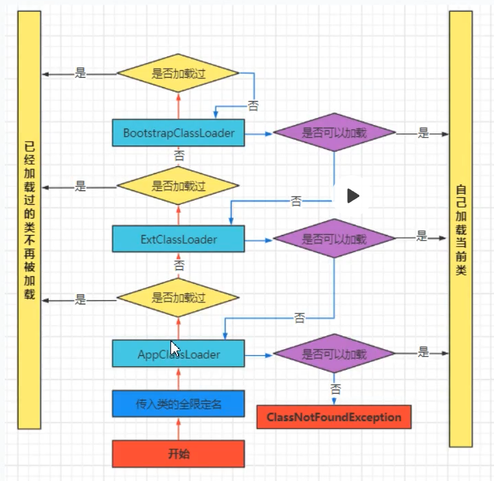

# 0、类加载机制

~~~text
    1、 class ---> 文件流  ——>  类加载器（加载到方法区）
    2、 在 堆内存中 创建指向 方法区内存的指针。
    3、 注意：在类加载的过程中，可以对 类进行增强 （Java Agent）
~~~

## 1、类加载机制

### 1、1类加载的主要流程

#### 1.1.1、加载

将存放在（磁盘，网络 ...）类的字节码文件所包含的数据读入内存，同时我们会生成数据的访问入口的一种特殊机制。

这一过程中，能够对加载 的 类文件进行增强处理 （ASM , javassist）

具体流程

~~~text
    （1）通过一个类的全限定名获取定义此类的二进制字节流 -- 类加载器 -- 负责在磁盘中找到对应的字节码文件
        1、BootStrap ClassLoader   -- 引导类加载器
        2、Extension ClassLoader   -- 拓展类加载器
        3、Application ClassLoader -- 应用类加载器
        4、Customer ClassLoader    -- 自定类加载器
    （2）将这个字节流所代表的静态存储结构转化为方法区的运行时数据结构
    （3）在Java堆中生成一个代表这个类的java.lang.Class对象，作为对方法区中这些数据的访问入口
~~~

#### 1.1.2、 链接

#### a、验证 （取消验证： -Xverify:none）

1、保证 加载的文件 是符合 虚拟机规范的。

2、不会破坏虚拟机的运行环境。

~~~text
    1. 文件格式   : 符合 jvm 规范  -- 能正确加载到方法区
    2. 元数据验证 : 验证 java 语意校验
    3. 字节码：
        1. 运行时检查
        2. 栈数据类型和操作码
    4. 符号引用 -！！- 发生在解析阶段 -！！- 
        1. 符号引用 --> 直接引用
~~~

#### b、准备

为类的静态变量分配内存，并赋予默认值。

~~~text
    static final -- 基础数据类型/String [ConstantValue] 编译时赋初始值
                    对象数据数据类型 必须 立马赋值 -- 编译时也会有初始值
~~~

#### c、解析

~~~text
    1、类中 符号引用 --> 直接引用
    2、缓存类解析结果
~~~

### 1.1.3、初始化

执行类 
构造器方法 != 构造方法
（类变量的赋值动作和静态代码块中的语句合并产生）

~~~text
    1、调用 new()
    2、调用 子类 new()
    3、访问 静态成员
    4、访问 静态方法
    5、反射 （Class.forName("com.carl.Test")）
~~~

### 1.1.4、卸载

~~~text
    1、该类的所有实列都被回收
    2、该类的 类加载器 被回收
    3、该类的所有 Class 没有被引用 
~~~

## 2、类加载的特性

### 2.1、双亲委派

### 2.2、全盘委托

### 2.3、缓存机制