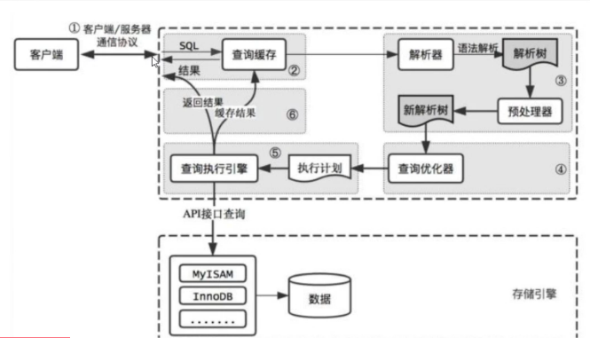
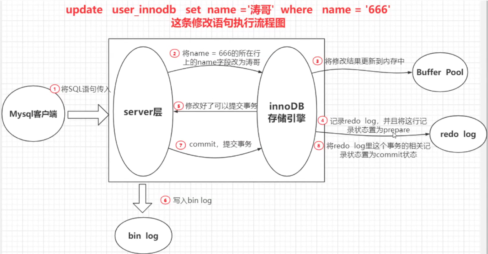
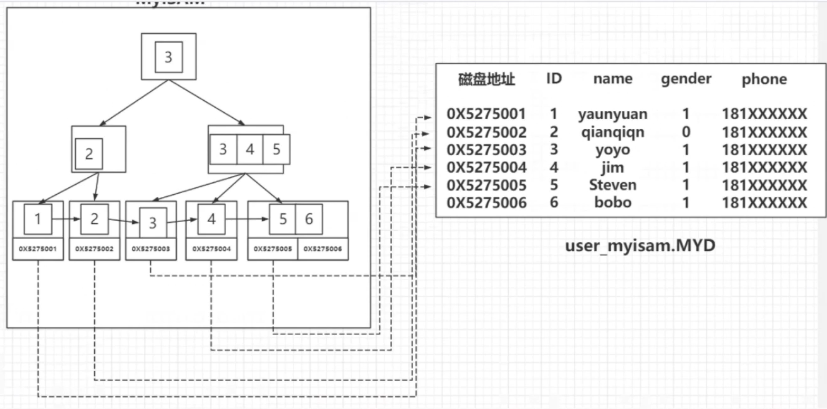
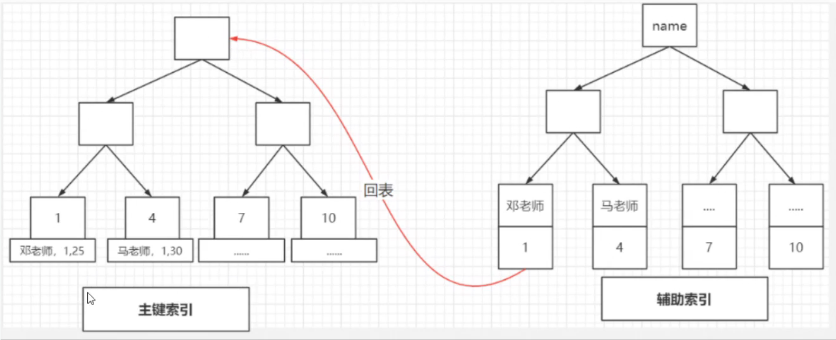
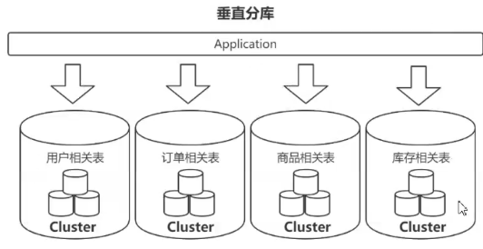

# 1、日志

## 1、Bin Log (server 层)

~~~
1、数据恢复
2、主从复制

特点：
	1、以事件的形式记录所有的 DDL && DML 语句。 
	2、全量数据备份
	
	数据丢失到恢复时间，产生的生产数据 需要人为的 精细化恢复。
~~~

数据恢复

~~~
1、预读取 ： 局部性原理
2、Buffer pool :  
	避免 每次访问都 进行磁盘 I/O ,提高访问速度
	
	Buffer Pool 的内存淘汰策略
		1、最近最久未使用（LRU）
		2、先进先出（FIFO）
		3、最近未使用 （LFU）
		
	Buffer Pool (热区：5/8；冷区：3/8)
	
	第一次进 ：冷区的头部
	如何进入热区 ：对缓存中的数据 （innodb_old_blocks_time）1秒 后再次访问，就将数据加载到 热区
	为什么是 1秒 ： 因为 预读机制 + 全表扫描 基本数据操作都在 1秒内完成，再次访问基本能确定 会成为热区数据。
	
假如 buffer pool 太大，怎么保证数据不丢？？？
~~~

## 2、Redo Log (物理日志) D

~~~
1、记录数据存放的内存块
~~~

# 2、数据库的体系结构（一条 sql 的执行）

~~~
1、连接：连接到数据库管理
2、查询缓存
3、解析
	词法解析
	语法解析
	
	注：检查语法是否出错。表是否存在，列是否存在
4、优化器
	基于成本的优化。（并不一定是最优的执行计划）
	
	小表驱动大表：减少中间数据的 size()，避免中间数据的保存。
5、执行引擎
~~~

# 3、为什么要用 B+ 树 做存储

~~~
1、B+ 树 能够减小 IO 次数
2、查询效率更加稳定（叶子节点存储数据）
3、提高范围查询的效率
4、顺序读写效率更高
	磁盘片，磁头，主轴，集成电路板
	寻道时间 + 旋转时间 + 传输时间
~~~

# 4、索引的使用原则

~~~
1、where 条件做索引
2、索引不易过多
3、区分度不高的不宜做索引
4、随机无序的值
5、创建复合索引
~~~

## 1、列的离散度

## 2、联合索引的最左匹配原则

## 3、覆盖索引 || 回表

# 5、索引失效

查询值不确定

~~~
1、索引列上使用函数
2、隐私转换
3、like 左匹配
4、负向查询 not like
~~~

# 6、hash 索引

根据 索引字段 经过 hash 算法 计算出 hashCode 映射到磁盘地址

~~~1
1、hash 碰撞问题 需要去解决，引入（链地址法，开放寻址）效率会降低。
~~~

# 7、MyiSAM && Innodb

## 1、文件信息

### 1、MyiSAM：myi(index) + myd(data) 。索引 --> data

### 2、Innodb。数据 即 索引

# 8、数据库的事务

## 1、什么是数据库的事务

~~~
1、多个数据库表的操作是一个原子性，要么全部成功，要么全部失败；

操作不可再分割（原子性）
有多个 DML 组成 
~~~

## 2、事物的特性

### 1、原子性（undoLog：事务修改之前的值）

### 2、隔离性（对数据的同一行数据进行操作，两个业务是互不干扰）

### 3、**一致性**（完整性约束不被破坏，前后数据都是有效的;最重要 ）

### 4、永久性（redoLog）

~~~
开启事务 
	begin;
	start transaction;
结束事务
	commit;
	rollback;
	断开连接;
~~~

| 隔离级别 | 异常       |                                                              |
| -------- | ---------- | ------------------------------------------------------------ |
| 读未提交 | 脏读       | 读到其他事务未提交的数据                                     |
| 读提交   | 不可重复读 | 读到其他事务提交的数据                                       |
| 可重复读 | 幻读       | 只能阻止（update/delete），不能阻止 insert 对于 Innodb 5.5 以上不会发生 |
| 串行化   | 效率低     |                                                              |

~~~
SQL92标准：官网很low,是一个 txt 文档
~~~

# 9、读一致性问题

## 1、LBCC(Lock Based Concurrency Control)

~~~
在读取数据的时候，锁定读取的数据，不允许其他事务修改。

缺点
	不支持并发的读写操作。大大降低数据操作的效率
~~~

## 2、MVCC

~~~
保证读取数据一致，在修改数据的时候建立一个备份/快照，后面的读取就只需要读取快照就可以了。
查询到本事务开始时已经存在的数据，在本次事务结束前，不论什么时候读取都会是一样的。

创建版本：创建数据的当前事务ID
删除版本：删除当前数据的事务ID
~~~

# 9、数据库的锁

# 10、分库分表

## 1、垂直分库（按业务）

## 2、水平分表（数据维度切分）

# 11、如何进行慢查询SQL

## 1、打开慢日志的开关

~~~sql
show variables likes 'slow_query%';

show variables likes 'long_query%';
~~~

## 2、慢日志解析（mysqldumpslow）

~~~
1、--verbose
2、--debug
~~~

# 12、如何优化慢sql 

## 1、explain 显示执行计划

~~~
1、id 先大后小；id一样 自上而下
2、type: system > const > eq_ref > ref > range > index > all
3、key:实际用到的索引
4、key_len:索引的长度
5、Extra:
	Using index:索引能够覆盖所有的查询字段
	Using filesort:待排序的内容无法通过索引直接直接进行排序
	Using where:表示当前查询的字段不能被索引覆盖
	Using where;Using index:表示查询的列被索引覆盖，且where筛选条件是索引列前导列的一个范围
~~~

## 2、小表驱动大表