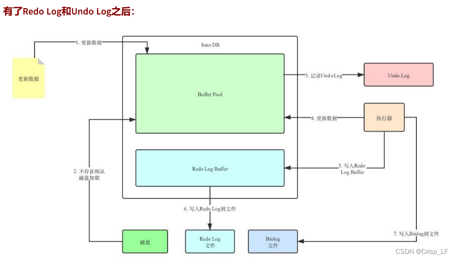
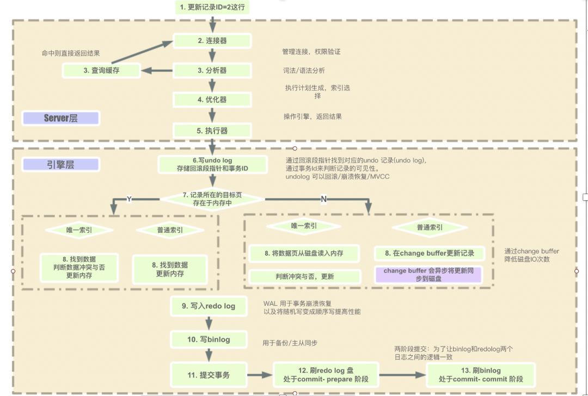
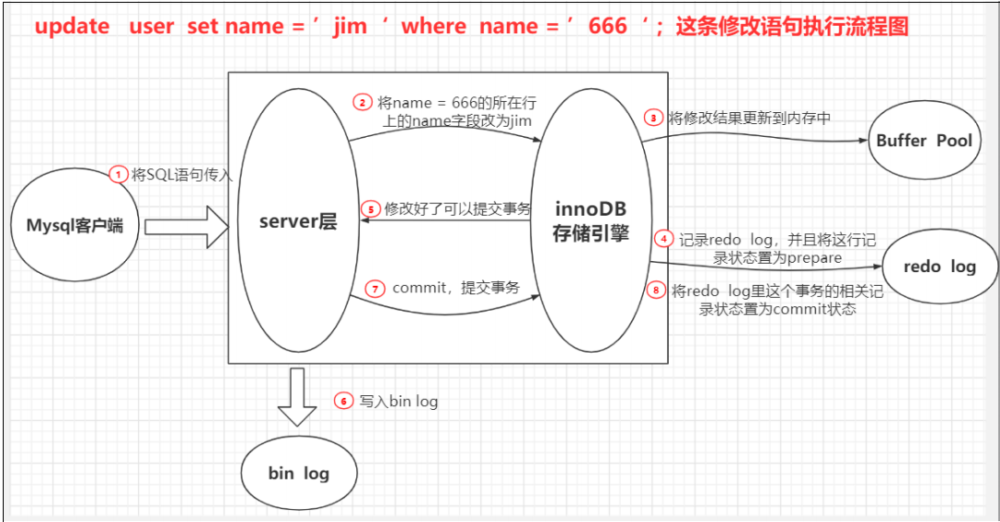

# MySQL

## 1、执行监控

### 1、show profile

~~~
1.设置属性：set profiling=1
2.执行的统计时间：show profiles;
3.执行的具体时间：show profile;
4.指定某一条sql : show profile for query query_id
	其他指标：all ,cpu ,block io , context switch ...
~~~

### 2、performance Schema(不会持久化)

~~~
SHOW VARIABLES LIKE "performance_schema";

监控 mysql server 的执行情况，监控事件（锁，i/o）
~~~

## 2、数据类型的优化

### 1、数据类型优化

~~~，
1、选择合适的数据类型（INET_ATON,INET_NTOA）
2、简单就好
3、尽量避免 null (null !=null)
4、细则。
	1.整形选择合适的长度。
	2.字符型。
		a.char. 固定长度（255），自动删除后面的空格
		b.varchar.(长度255 区分长度的保留（1字节，2字节  ）)
		c.text
		d.blob
	3.时间
		a.datatime。8字节，与时区无关，支持毫秒
		b.timestamp。4字节，依赖数据库时区，精确到秒。
		c.date。3字节，支持时间函数
	4.枚举
		a. cerate table enun_test(e enum("a","b","c")not null);
	5.ip 地址
~~~

### 2、合理使用范式

减少数据冗余 

### 3.主键选择

#### 1、代理主键（推荐使用）

与业务无关的无意义序列（id）

#### 2、自然主键

事务属性的自然唯一标识（身份证号。。。）

### 3、字符集的选择

~~~
UFT8：中文3个字节。（只能存两个字节内的中文）
utf8mb4：可以存 3 个字节的中文
~~~

### 4、存储引擎(数据文件的组织形式)

#### 

~~~
myISAM：不支持 事务，行锁，外键

聚簇索引：索引与数据在一起的索引
非聚簇索引：索引与数据不在一起的索引

加锁：是个索引加锁。条件是索引，加行锁;否咋加表锁
~~~

## 3、执行计划（explain）

~~~
id：sql 执行的顺序。id 值越大越先执行。
select_type 复杂度
	simple:普通查询
type 访问方式
	system>const>eq_ref>ref>fulltext>ref_or_null>index_merge>unique_subquery>index_subquery>range>index>all
possible_keys 
key
key_lens：越短越好
Extra
~~~

## 4、索引（B+树）优化

~~~
1、文件
2、偏移量

hash：不适合范围查询
二叉树：树的倾斜
平衡二叉树：增删性能低
红黑数：高度差 2 倍之内
B 树：非叶子节点存数据
3层 B+树：非叶子节点只存指针，叶子节点存数据
B* 树
~~~

### 1、索引的分类

~~~
1、主键索引
2、唯一索引
3、全文索引
4、组合索引
~~~

### 2.优化

~~~
1. 尽量覆盖索引，减少回表
2. 排序列
	尽量与 where 组合能够满足左前缀原理
3. 范围查询，之后的索引失效
4. union all,in,or
	union all 相较于 union 有去重功能。
	in 
	or 
~~~

## 2、Innodb 三大特性

### 1、自适应hash

类似于缓存

~~~
内部监控索引表，某个索引经常使用（热数据），在内部创建一个 hash 索引，下次查询时，根据 hash 索引查找

show engion innodb status

show variable like "innode_adaptive%"
~~~

### 2、buffer Pool

缓存磁盘页（16K 的数据）

~~~
show variable like "innode_buffer%" 8M 

~~~

### 3、双写机制（doublewrite buffer）磁盘

数据页的可靠性 <a hert="https://zhuanlan.zhihu.com/p/272720373#:~:text=Double%20write,buffer%20%E5%AE%83%E6%98%AF%E5%9C%A8%E7%89%A9%E7%90%86%E6%96%87%E4%BB%B6%E4%B8%8A%E7%9A%84%E4%B8%80%E4%B8%AAbuffer%2C%20%E5%85%B6%E5%AE%9E%E4%B9%9F%E5%B0%B1%E6%98%AFfile%EF%BC%8C%E6%89%80%E4%BB%A5%E5%AE%83%E4%BC%9A%E5%AF%BC%E8%87%B4%E7%B3%BB%E7%BB%9F%E6%9C%89%E6%9B%B4%E5%A4%9A%E7%9A%84fsync%E6%93%8D%E4%BD%9C%EF%BC%8C%E8%80%8C%E5%9B%A0%E4%B8%BA%E7%A1%AC%E7%9B%98%E7%9A%84fsync%E6%80%A7%E8%83%BD%E9%97%AE%E9%A2%98%EF%BC%8C%E6%89%80%E4%BB%A5%E4%B9%9F%E4%BC%9A%E5%BD%B1%E5%93%8D%E5%88%B0%E6%95%B0%E6%8D%AE%E5%BA%93%E7%9A%84%E6%95%B4%E4%BD%93%E6%80%A7%E8%83%BD%E3%80%82">双写机制链接</a>

数据库崩溃恢复时保证数据不丢失

~~~
数据刷脏的时候，先拷贝到 内存 doublewrite buffer 中
然后再 顺序写到 磁盘 共享表空间中（doublewrite buffer）
然后再 离散写到 数据文件中
~~~

