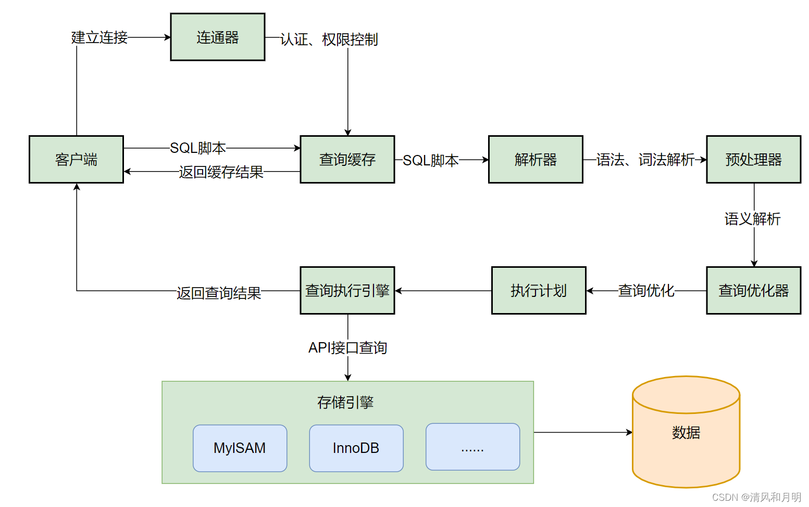
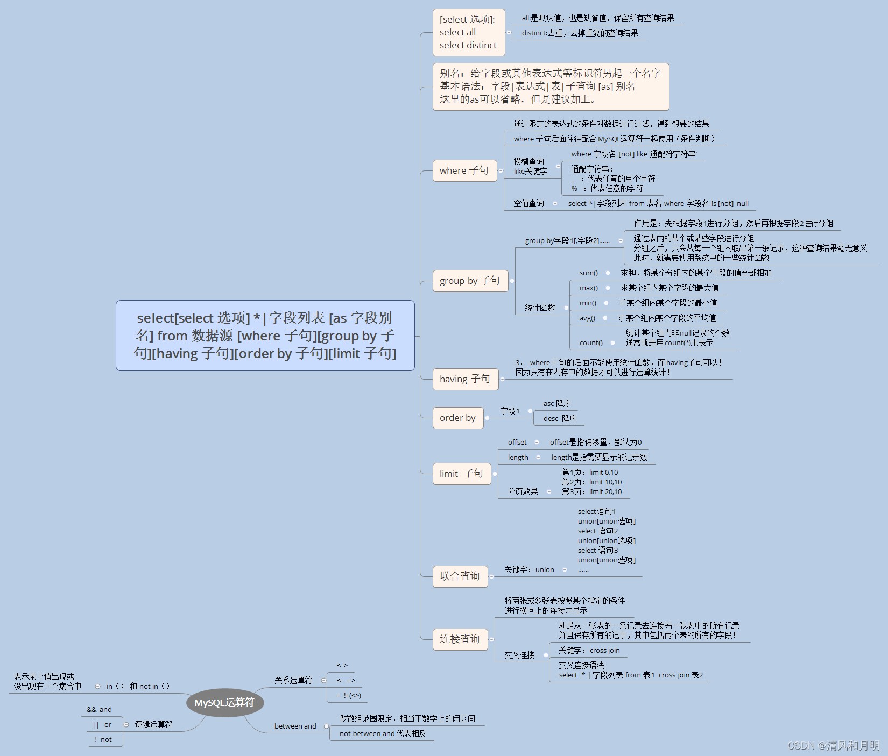
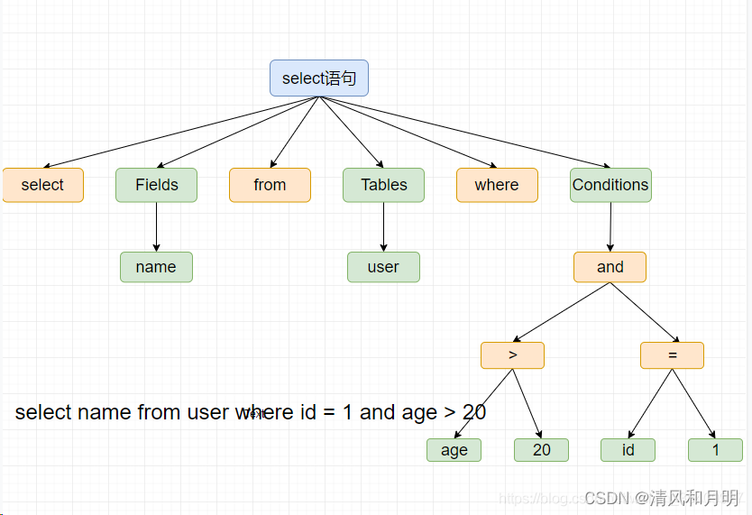
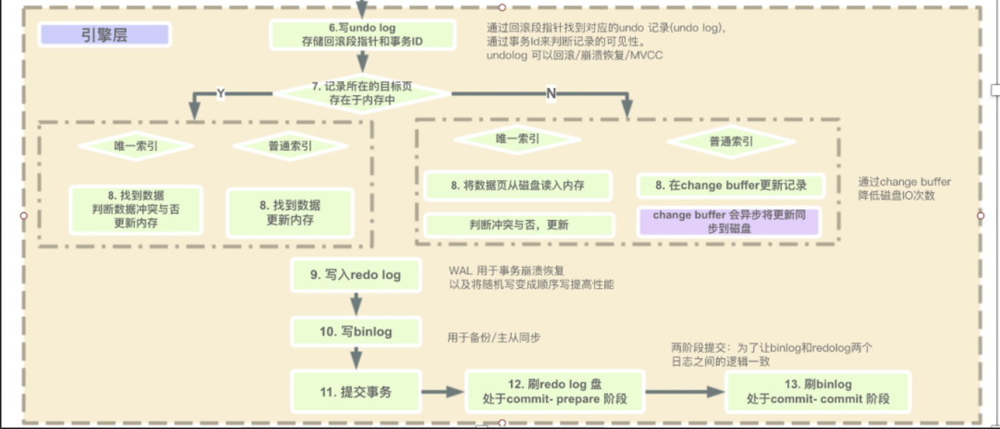

# 0.sql 的执行流程

~~~
一条 SQL 语句的执行流程，需要经过很多的步骤
~~~

## 1、执行的总体流程

### 1.1 涉及到的组件

#### a、建立连接

~~~text
    Client 与 Server 建立连接、进行鉴权、保持连接、管理连接。
        最大连接数 : SHOW VARIABLES LIKE 'max_connections'; (default : 151) 
        当前连接数 : SHOW PROCESSLIST
~~~

#### b、查询缓存

~~~text
    数据查询的结果会保存到一个引用表中，通过一个哈希值引用，这个哈希值包括了以下因素，即查询本身、当前要查询的数据库、客户端协议的版本等一些其他可能影响返回结果的信息
    
    缺点 : 将连接信息 + sql 脚本 等原始信息当作查询缓存的条件，任何修改都可能导致 缓存不命中
          当查询条件中存在不确定的 数据 或 函数 时，缓存也可能不会命中（NOW()，CURRENT_DATE()）
          
    不建议使用 而且在 8 以上缓存机制已经被 移除
~~~

#### c、分析器

##### c.1、词法分析

~~~
    从左到右一个字符、一个字符地输入，然后根据构词规则识别单词。
~~~

##### c.2、语法分析

~~~
    语法解析，判断输入的这个 SQL 语句是否满足 MySQL 语法.
~~~

##### c.3、语义分析

~~~
    对语句中涉及的 表、索引、视图 等对象进行解析，并对照数据字典检查这些对象的名称以及相关结构
~~~

#### d、预处理器

~~~
即时 SQL : 一次编译，单次运行
预处理 SQL : 一次编译 多次执行
            每次执行的时候只有个别的值不同（比如 select 的 where 子句值不同，update 的 set 子句值不同，insert 的 values 值不同）
~~~

#### e、优化器

~~~
按照一定原则来计算目标SQL在当前情形下最有效的执行路径,优化器的目的是为了得到目标SQL的执行计划。
分为两种方式
    RBO : Rule_Based
    CBO : Cost_Based
~~~

##### e.1 RBO

~~~text
    一组内置的规则，这些规则是硬编码在数据库的编码中 --- 规则恒定
        其中之一 : 有索引使用索引。那么所有带有索引的表在任何情况下都会走索引
~~~

##### e.2 CBO

~~~text
    从目标诸多的执行路径中选择一个成本最小的执行路径来作为执行计划
    综合 相关统计信息计算出的 对应的步骤的IO，CPU等消耗 --- 计算复杂
~~~

[优化后获得 sql 执行计划](./mysql_invoke_plan.md)

#### f、执行器（查询存储引擎）

~~~text
    开始执行的时候，首先要确认我们是否有操作这个表的权限，如果没有权限则会返回没有权限的错误
    如果有权限，就打开表权限执行，打开表的时候执行器会根据表的引擎定义，去使用这个引擎提供的接口。
~~~

