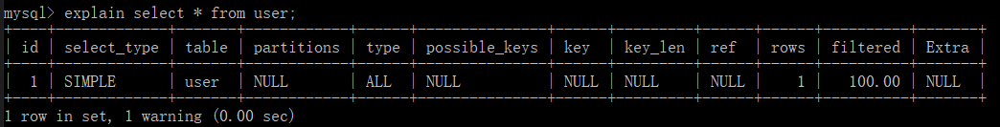

[参考资料](https://www.cnblogs.com/sunjingwu/p/10755823.html)

# 0.执行计划

~~~text
    经过 优化器优化后，会获得目标 sql 的 最终的执行计划
    
    explain sql
~~~

## 1、执行计划的说明

### 1.1、id （ sql 执行顺序)

~~~text
    1、id 越大 越先执行;
    2、id 相同 从上到下依次执行
~~~

### 1.2 select_type （查询语句类型）

~~~text
    1、simple   : 简单查询
    2、primary  : 嵌套查询 最外层
    3、subQuery : 嵌套查询 内层
    4、union    : union 查询 后者
~~~

### 1.3 table 查询涉及的表或衍生表

### 1.4 partitions 查询涉及到的分区

~~~sql
-- 创建分区表，
-- 按照id分区，id<100 p0分区，其他p1分区
create table user_partitions
(
    id   int auto_increment,
    name varchar(12),
    primary key (id)
)
    partition by range (id)(
        partition p0 values less than (100),
        partition p1 values less than maxvalue
        );
~~~

### 1.5 type 提供了判断查询是否高效的重要依据依据

~~~text
    system : 表中只有一条数据，相当于系统表; (这个类型是特殊的 const 类型)
    const  : 主键 / 唯一索引 的常量查询，表格最多只有1行记录符合查询
    eq_ref : 唯一索引扫描，对于每个索引键，表中只有一条记录与之对应
    ref    : 普通索引查询  多表的 join 查询, 针对于非唯一 或 非主键索引 或者 使用了最左前缀规则索引的查询
    range  : 表示使用索引范围查询 （全部索引）
    index  : 索引覆盖
    ALL    : 全表扫描,没有任何索引（联合索引）可以使用时。
~~~

### 1.6 possible_keys 可以从中选择的索引。

### 1.7 key 查询实际使用到的索引

### 1.8 key_len 表示索引中使用的字节数

### 1.9 select_type

### 1.10 select_type

### 1.11 select_type

### 1.12 select_type

