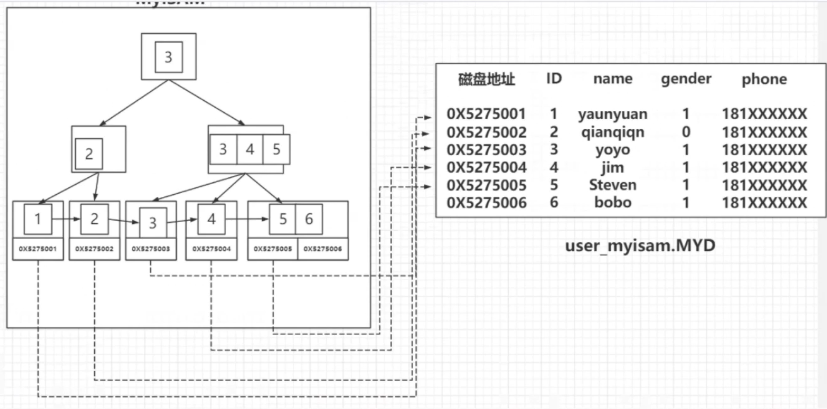
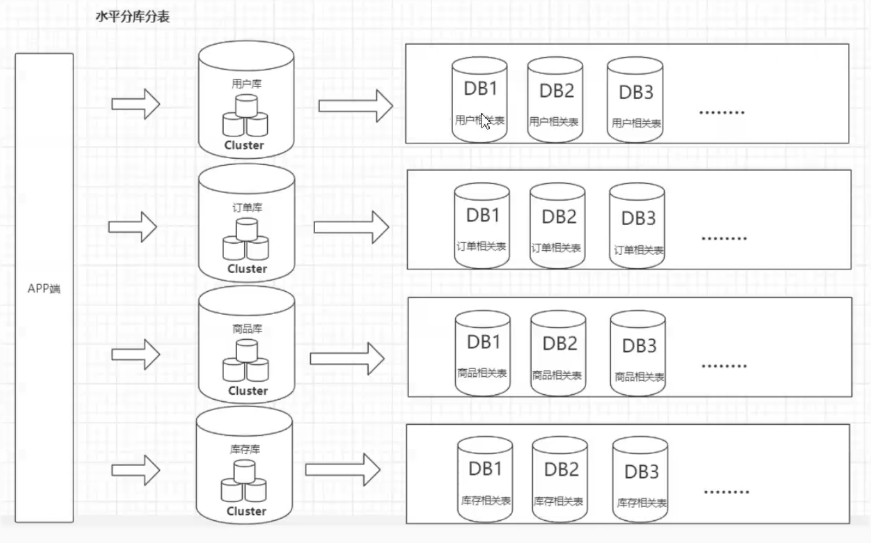

# 0、sql 调优

~~~text
    sql 优化是一个很重要的 数据库 性能提升方式
~~~

## 1、mysql 的搜索引擎

#### 

### 1、MyiSAM

~~~text
    MyiSAM === myi(index) + myd(data) 。
    先读取索引文件 index ,在读取 data 文件。
~~~

### 2、Innodb。数据 即 索引

~~~text
    索引树 和 数据 是存放在一个文件中
    聚簇索引   : 主键索引(唯一索引) 加上 完整数据
    非聚簇索引 : 索引 + 主键索引
~~~

## 2、搜索引擎的组织结构

### 2.1、二分查找

~~~text
    不利于数据的增删
~~~

### 2.2 二叉查找树

~~~text
    对于顺序添加的数据，会退化为单链表，查询效率低
~~~

### 2.3 平衡二叉树（AVL Tree）（左旋、右旋）

~~~text
    io 次数多
~~~

### 2.4 多路平衡查找树（B Tree）

~~~text
    数据存放在非叶子节点，不利于范围查找
    做索引查找的时候，会加载许多无关数据（非索引数据）
~~~

### 2.5  B+树

~~~text
    优点：1、性能稳定，排序能力强
         2、对数据的覆盖更加广
         3、兼具 B 树的优点
~~~

## 3、索引创建与使用

### 3.1、索引创建

#### 3.1.1、索引的分类

~~~text
    1、主键索引
    2、唯一索引
    3、联合索引
    4、普通索引
~~~

#### 3.1.2、适合建索引

~~~text
    1、区分度足够高
    2、顺序递增，且不乱序
    3、更新不频繁
~~~

### 3.2、索引失效

~~~text
    1、函数作用与索引字段  -- 出现隐式转换（这个尤其注意） -- 字符串不加'"',
    2、模糊匹配时左模糊
    3、范围查询条件后的索引字段
    4、负向查询  (主键)    -- 避免使用（NOT LIKE，not in，<> ，!=）
~~~

## 4、优化思路

~~~text
    从 一个 sql 执行的整个流程作为优化的流程
~~~

### 4、1数据库连接

#### 4.1.1、服务端的优化

~~~text
    1、增大服务端的最大连接数           -- 151
    2、即时关闭服务端长时间不活跃的连接   -- 8h
~~~

#### 4.1.2、客户端的优化

~~~text
    1、减少从服务端获取的连接数 -- 数据库连接池
    2、引入数据缓存           -- redis/elasticsearch
~~~

### 4.2 缓存 --> 架构优化

#### 4.2.1 缓存

~~~text
    增加内存级别的缓存，减少数据库查询的压力
        穿透 : 查询一个缓存中和数据库中都不存在的数据
              a、存空对象
              b、布隆过滤器  -- 数据一致增加，无法删除，需要手动删除部分数据 -- 产生误删 -- 基于记数
              c、布谷鸟过滤器 -- 两个 hash 算法计算位置 -- 将原本位置的踢出，并未原本位置的找到一个位置
              
        击穿 : 单个热点key，在不停的扛着大并发，在这个key失效的瞬间，持续的大并发请求就会击破缓存，直接请求到数据库
              a、热点数据不设置过期时间
              
        雪崩 : 缓存中大量热点缓存在某一个时刻同时实效，请求全部转发到数据库，导致数据库压力骤增，甚至宕机。进而形成一系列的连锁反应
              a、随机过期时间
              b、雪崩发生时，服务熔断、限流、降级等措施保障
~~~

#### 4.2.2 主从 + 读写分离

单台数据库无法满足时（大概是一个什么条件？？？），就考虑做主从架构

~~~text
    1、从服务器会获取主服务器的 binlog 文件，然后解析里面的 SQL 语句，在从服务器上面执行一遍，保持主从的数据一致。
        a、连接到 master 获取 binlog，并且解析 binlog 写入中继日志，这个线程叫做 I/O 线程。
        b、Master 节点上有一个 log dump 线程，是用来发送 binlog 给 slave 的。
        c、从库的 SQL 线程，是用来读取 relay log，把数据写入到数据库的。
~~~

#### 4.2.3 分库分表

##### 垂直分库（按业务）

~~~text
    数据库按照业务拆分成不同的数据库 -- 减少并发压力
~~~

##### 水平分表（数据维度切分）

~~~text
 单张表的数据按照一定的规则分布到多个数据库 -- 解决存储瓶颈
~~~

### 5、优化器

### 1、show profile

#### 1、执行监控

查看  SQL 语句执行的时候使用的资源，比如 CPU、IO 的消耗情况。

~~~text
    1、设置属性：set profiling=1
    2、执行的统计时间：show profiles;
    3、执行的具体时间：show profile;
    4、指定某一条sql : show profile for query query_id
	其他指标：all ,cpu ,block io , context switch ...
~~~