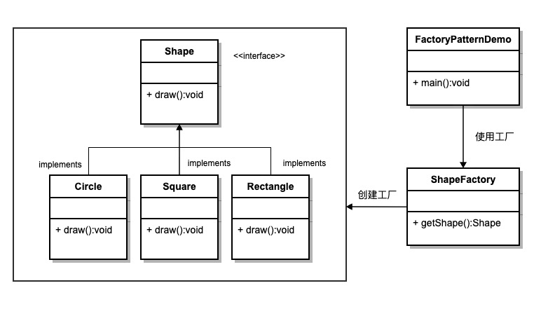
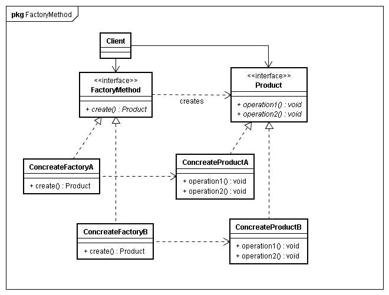
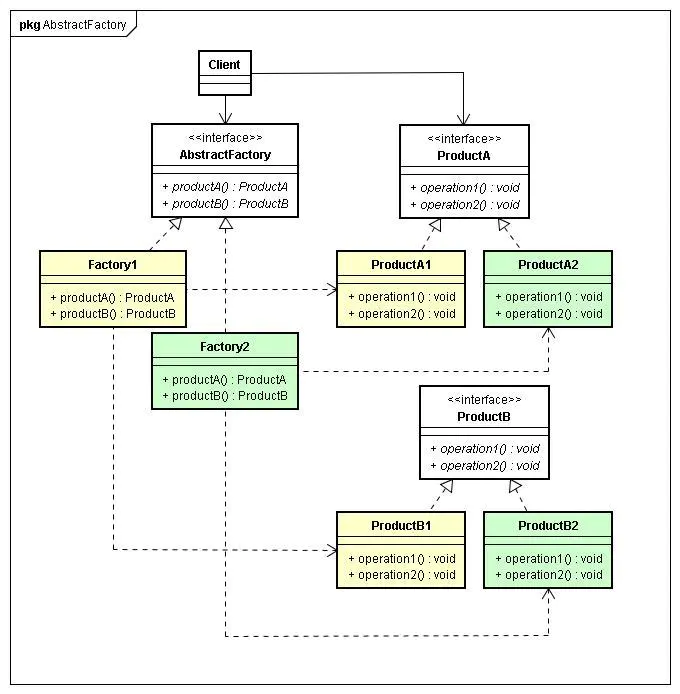

# 0、简介

~~~
 该模式用来封装和管理类的创建，终极目的是为了解耦，实现创建者和调用者的分离。
 
 Factroy ： 要解决的问题是：希望能够创建一个对象，但创建过程比较复杂，希望对外隐藏这些细节。
~~~

## 1、简单工厂 (1 -> 1)

### 0 类图

### 1.1特点

~~~
 简单工厂模式 仅仅是 一种编程习惯。
~~~

### 1.2 实现

~~~java
/**
 * 抽象产品
 */
public interface Coffee {
    void drink();
}

/**
 * 具体产品 -- AmericanoCoffee
 */
public class AmericanoCoffee implements Coffee {
    @Override
    public void drink() {
        //todo
    }
}

/**
 * 具体产品 -- LatteCoffee
 */
public class LatteCoffee implements Coffee {
    @Override
    public void drink() {
        //todo
    }
}

/**
 * 创建一个抽象类：抽象子类的共有方法
 * 创建子类实现父类的抽象方法
 * 在工厂方法中根据类型创建不同的具体对象
 **/
public class SimpleCoffeeFactory {
    // 根据type判断类型，实例化并返回对应对象
    public Coffee createCoffee(String type) {
        Coffee coffee = null;
        if ("americano".equals(type)) {
            coffee = new AmericanoCoffee();
        } else if ("latte".equals(type)) {
            coffee = new LatteCoffee();
        }
        return coffee;
    }
}
~~~

### 1.3 优缺点

~~~
简单 

扩展性不强
~~~

## 2、工厂模式 （1 -> n）

~~~ 
 一个工厂 -- 能创建所有的产品 
核心 ： 封装类中变化的部分，提取其中个性化善变的部分为独立类，通过依赖注入以达到解耦、复用和方便后期维护拓展的目的。
~~~

### 2.1类图

### 2.2实现

~~~java
/**
 * 抽象工厂类
 */
public interface Factory {
    Product create();
}

/**
 * 抽象产品类
 */
public interface Product {
    void method1();

    void method2();
}

/**
 * 具体产品类
 */
public class PhoneProduct implements Product {
    public void method1() {
    }

    public void method2() {
    }
}

public class TvProduct implements Product {
    public void method1() {
    }

    public void method2() {
    }
}

/**
 * 具体产品工厂
 */
public class PhoneProductFactory() {
    public Product create() {
        new PhoneProduct();
    }
}

public class TvProductFactory() {
    public Product create() {
        new TvProduct();
    }
}

public class Main {
    public static void main(String[] args) {
        Factory factory = new PhoneProductFactory();
        Product phone = factory.create();
        phone.method1();
        phone.method2();
    }
}

~~~

### 2.3 优缺点

~~~
 优点 : 解决产品扩展能力不足的问题
 缺点 ：每次增加一个产品时，都需要增加一个具体类和对象实现工厂
~~~

## 3、抽象工厂 (n -> n)

### 3.1类图

### 3.2实现

~~~java
/**
 * 抽象工厂类
 */
public interface AbstractFactory {
    Phone createPhone();

    Tv createTv();
}

/**
 * 抽象产品类
 */
public interface Phone {
    void methodPhone1();

    void methodPhone2();
}

public interface Tv {
    void methodTv1();

    void methodTv2();
}

/**
 * 具体产品类
 */
public class IPhone implements Phone {
    public void methodPhone1() {
    }

    public void methodPhone2() {
    }
}

public class XiaoMiPhone implements Phone {
    public void methodPhone1() {
    }

    public void methodPhone2() {
    }
}

public class ITv implements Tv {
    public void methodTv1() {
    }

    public void methodTv2() {
    }
}

public class XiaoMiTv implements Tv {
    public void methodTv1() {
    }

    public void methodTv2() {
    }
}

/**
 * 具体产品工厂
 */
public class AppleFactory() implements AbstractFactory {
    public Phone createPhone() {
        return new IPhone();
    }

    public Tv createTv() {
        return new ITv();
    }
}

public class MiFactory() implements AbstractFactory {
    public Phone createPhone() {
        return new XiaoMiPhone();
    }

    public Tv createTv() {
        return new XiaoMiTv();
    }
}

public class Main {
    public static void main(String[] args) {
        AppleFactory apple = new AppleFactory();
        Phone iPhone = apple.createPhone();
        iPhone.methodPhone1();
        iPhone.methodPhone2();
    }
}
~~~

### 3.3优缺点

~~~
1、当一个产品族中的多个对象被设计成一起工作时，它能保证客户端始终只使用同一个产品族中的对象。
2、抽象产品族扩展非常困难 ；既要在 AbstractFactory 里加代码，又要在具体的 Factory 里面加代码。
~~~