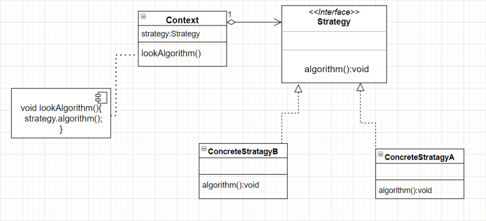

# 0、定义

~~~
它将对象和行为分开，将行为定义为 一个行为接口 和 具体行为的实现。
策略模式最大的特点是行为的变化，行为之间可以相互替换。
每个 if 判断都可以理解为就是一个策略。本模式使得算法可独立于使用它的用户而变化
~~~

## 策略模式

### 1、类图

### 2、实现

~~~java
/**
 * 抽象策略
 */
public interface Strategy {
    public int doOperation(int num1, int num2);
}

/**
 * 具体策略
 */
public class OperationAdd implements Strategy {
    @Override
    public int doOperation(int num1, int num2) {
        return num1 + num2;
    }
}

public class OperationSubtract implements Strategy {
    @Override
    public int doOperation(int num1, int num2) {
        return num1 - num2;
    }
}

public class OperationMultiply implements Strategy {
    @Override
    public int doOperation(int num1, int num2) {
        return num1 * num2;
    }
}

/**
 * context
 */
public class Context {
    private Strategy strategy;

    public Context(Strategy strategy) {
        this.strategy = strategy;
    }

    public int executeStrategy(int num1, int num2) {
        return strategy.doOperation(num1, num2);
    }
}

/**
 * main
 */
public class StrategyPatternDemo {
    public static void main(String[] args) {
        Context context = new Context(new OperationAdd());
        System.out.println("10 + 5 = " + context.executeStrategy(10, 5));

        context = new Context(new OperationSubtract());
        System.out.println("10 - 5 = " + context.executeStrategy(10, 5));

        context = new Context(new OperationMultiply());
        System.out.println("10 * 5 = " + context.executeStrategy(10, 5));
    }
}
~~~

### 3、优缺点

~~~
~~~