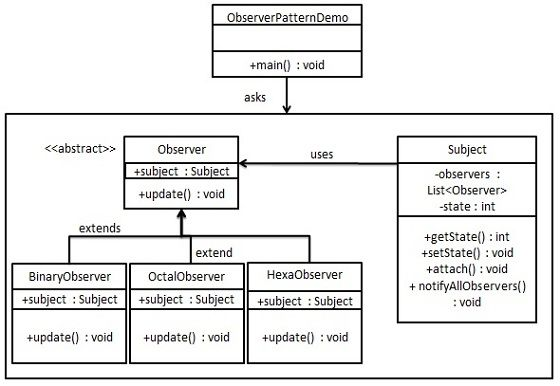

# 0、观察者模式

~~~
~~~

## 观察者模式

### 1、类图

### 2、实现

~~~java
/**
 * object
 */
@Data
public class Subject {

    private List<Observer> observers = new ArrayList<Observer>();
    private int state;

    public void attach(Observer observer) {
        observers.add(observer);
    }

    public void notifyAllObservers() {
        for (Observer observer : observers) {
            observer.update();
        }
    }
}

/**
 * 抽象 观察者 信息
 */
public abstract class Observer {
    protected Subject subject;

    public abstract void update();
}

/**
 * 实际观察者
 */
public class BinaryObserver extends Observer {

    public BinaryObserver(Subject subject) {
        this.subject = subject;
        this.subject.attach(this);
    }

    @Override
    public void update() {
        System.out.println("Binary String: " + Integer.toBinaryString(subject.getState()));
    }
}

public class OctalObserver extends Observer {

    public OctalObserver(Subject subject) {
        this.subject = subject;
        this.subject.attach(this);
    }

    @Override
    public void update() {
        System.out.println("Octal String: " + Integer.toOctalString(subject.getState()));
    }
}

public class HexaObserver extends Observer {

    public HexaObserver(Subject subject) {
        this.subject = subject;
        this.subject.attach(this);
    }

    @Override
    public void update() {
        System.out.println("Hex String: " + Integer.toHexString(subject.getState()).toUpperCase());
    }
}

/**
 * main
 */
public class ObserverPatternDemo {
    public static void main(String[] args) {
        Subject subject = new Subject();

        new HexaObserver(subject);
        new OctalObserver(subject);
        new BinaryObserver(subject);

        System.out.println("First state change: 15");
        subject.setState(15);
        System.out.println("Second state change: 10");
        subject.setState(10);
    }
}
~~~

### 3、优缺点