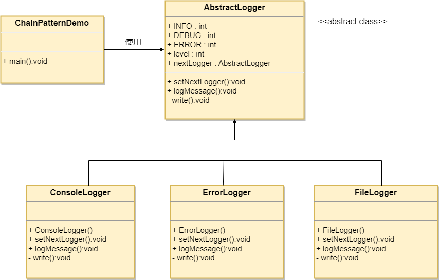

# 0、责任链模式

~~~
~~~

## 责任链模式

### 1、类图

### 2、实现

~~~java
/**
 * 抽象 过滤器 接口
 */
public interface Filter {
    void execute(String request);
}

public class FilterChain {

    /**
     * 存放过滤器得容器
     */
    private List<Filter> filters = new ArrayList<Filter>();

    /**
     * 新增过滤器
     * @param filter
     */
    public void addFilter(Filter filter) {
        filters.add(filter);
    }

    /**
     * 执行
     * @param request
     */
    public void execute(String request) {
        for (Filter filter : filters) {
            filter.execute(request);
        }
        target.execute(request);
    }
}

/**
 * 实际过滤器
 */
public class AuthenticationFilter implements Filter {
    public void execute(String request) {
        System.out.println("Authenticating request: " + request);
    }
}

public class DebugFilter implements Filter {
    public void execute(String request) {
        System.out.println("request log: " + request);
    }
}

/**
 * main
 */
public class InterceptingFilterDemo {
    public static void main(String[] args) {
        FilterChain filterChain = new FilterChain(new Target());
        filterChain.setFilter(new AuthenticationFilter());
        filterChain.setFilter(new DebugFilter());

        /**
         * execute
         */
        filterChain.sendRequest("HOME");
    }
}
~~~

### 3、优缺点