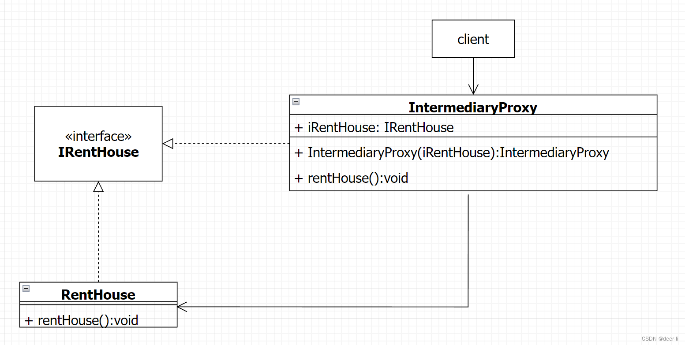

# 0.定义

~~~
1、代理对象具备真实对象的功能，并代替真实对象完成相应操作，并能够在操作执行的前后，对操作进行增强处理。
2、为真实对象提供代理，然后供其他对象通过代理访问真实对象
3、在源码运用中有非常广泛的使用
~~~

## 代理模式

### 1、静态代理

直接对被代理对行进行代理

#### 1.1、类图

#### 1.2、实现

~~~java
/**
 * 公共得行为接口
 */
public interface IRentHouse {
    void rentHouse();
}

/**
 * 实际对象 -- 被代理对象
 */
public class RentHouse implements IRentHouse {
    @Override
    public void rentHouse() {
        System.out.println("实现租房");
    }
}

/**
 * 代理对象
 */
public class IntermediaryProxy implements IRentHouse {
    private IRentHouse iRent;

    public IntermediaryProxy(IRentHouse iRentHouse) {
        iRent = iRentHouse;
    }

    @Override
    public void rentHouse() {
        System.out.println("交中介费");
        iRent.rentHouse();
        System.out.println("中介负责维修管理");
    }
}

/**
 * client测试类
 */
public class TestStaticProxy {
    public static void main(String[] args) {
        //定义租房 -- 被代理对象 
        IRentHouse iRentHouse = new RentHouse();
        //定义中介
        IRentHouse intermediaryProxy = new IntermediaryProxy(iRentHouse);
        //中介租房
        intermediaryProxy.rentHouse();
    }
}
~~~

#### 1.3、优缺点

~~~
当真实类的方法越来越多的时候，这样构建的代理类的代码量是非常大的
~~~

### 2、动态代理

~~~
1、使用一种方法的单个类（代理类）为具有任意数量方法的任意类（真实类）的多个方法调用提供服务 
~~~

#### 2.1 JDK 动态代理

基于反射实现得代理方式 -- java.lang.reflect --- InvocationHandler +++ Proxy

##### 2.1.1、类图

##### 2.1.2、实现

~~~java
public class TestJdkProxy {

    /**
     * 被代理类得公共接口
     */
    public interface Animal {
        void wakeup();

        void sleep();
    }

    /**
     * Cat 实现
     */
    @NoArgsConstructor
    @AllArgsConstructor
    public static class Cat implements Animal {
        private String name;

        @Override
        public void wakeup() {
            System.out.println("小猫" + name + "早晨醒来啦");
        }

        @Override
        public void sleep() {
            System.out.println("小猫" + name + "晚上睡觉啦");
        }
    }

    /**
     * Cat 实现
     */
    @NoArgsConstructor
    @AllArgsConstructor
    public static class Dog implements Animal {
        private String name;

        @Override
        public void wakeup() {
            System.out.println("修够 " + name + " 早晨醒来啦");
        }

        @Override
        public void sleep() {
            System.out.println("修够 " + name + " 晚上睡觉啦");
        }
    }

    /**
     * main
     * @param args
     */
    public static void main(String[] args) {

        /**
         * 被代理对象
         */
        Animal cat = new Dog("咪咪");

        Animal animal = (Animal) Proxy.newProxyInstance(TestJdkProxy.class.getClassLoader(), new Class[]{Animal.class}, new InvocationHandler() {

            /**
             * 代理方法执行
             * @param proxy 生成的代理对象
             * @param method 执行得方法
             * @param args 调用方法得参数
             * @return
             * @throws Throwable
             */
            @Override
            public Object invoke(Object proxy, Method method, Object[] args) throws Throwable {
                String methodname = method.getName();
                if (methodname.equals("wakeup")) {
                    System.out.println("早安~~~");
                } else if (methodname.equals("sleep")) {
                    System.out.println("晚安~~~");
                }
                return method.invoke(cat, args);
            }
        });

        animal.wakeup();
        animal.sleep();
    }
}
~~~

##### 2.1.3、优缺点

~~~
优点 ： 一个方法能够代理被代理对象得全部方法

缺点 ： 必须有被代理对象的实列  ；； 必须实现接口
~~~

#### 2.2 cglib 动态代理

##### 2.2.1、类图

##### 2.2.2、实现

~~~java
public class TestCglibProxy {

    /**
     * Cat 实现
     */
    @NoArgsConstructor
    @AllArgsConstructor
    public static class Dog {
        private String name;

        public void wakeup() {
            System.out.println("修够 " + name + " 早晨醒来啦");
        }

        public void sleep() {
            System.out.println("修够 " + name + " 晚上睡觉啦");
        }
    }

    public static void main(String[] args) {
        Enhancer enhancer = new Enhancer();

        Dog real = new Dog("dog");

        enhancer.setSuperclass(Dog.class);
        enhancer.setCallback(new MethodInterceptor() {
            /**
             *
             * @param o           代理对象
             * @param method      调用的方法（原方法）
             * @param objects     参数集合
             * @param methodProxy 生成得代理方法
             * @return
             * @throws Throwable
             */
            @Override
            public Object intercept(Object o, Method method, Object[] objects, MethodProxy methodProxy) throws Throwable {
                String methodName = method.getName();
                if (methodName.equals("wakeup")) {
                    System.out.println("早安~~~");
                } else if (methodName.equals("sleep")) {
                    System.out.println("晚安~~~");
                }
                /**
                 * 平替 -- methodProxy.invokeSuper(o, objects); 
                 */
                return method.invoke(real, objects);
            }
        });
        Dog dog = (Dog) enhancer.create();

        dog.wakeup();
        dog.sleep();
    }
}
~~~

##### 2.2.3、优缺点

~~~
1、不需要要求 必须实现某一个接口，生成得代理类是被代理类的子类
~~~