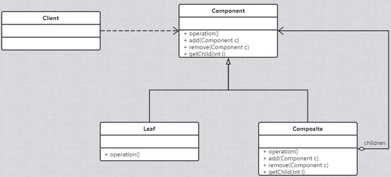

# 0、定义

## 组合模式

### 1、类图

### 2、实现

~~~java
/**
 * 抽象组件
 */
public abstract class Component {
    /**
     * 增加成员
     * @param c
     */
    public void add(Component c) {
    }

    /**
     * 删除成员
     * @param c
     */
    public void remove(Component c) {
    }

    /**
     * 获取成员
     * @param i
     * @return
     */
    public Component getChild(int i) {
    }

    /**
     * 业务方法
     */
    public void operation() {
    }
}

/**
 * 实际组件
 */
public class Leaf1 extends Component {
    @Override
    public void operation() {
        System.out.println("子构件");
    }
}

public class Leaf2 extends Component {
    @Override
    public void operation() {
        System.out.println("子构件");
    }
}

/**
 * 容器构建
 */
public class Composite extends Component {
    private List<Component> list = new ArrayList<Component>();

    @Override
    public void add(Component c) {
        list.add(c);
    }

    @Override
    public void remove(Component c) {
        list.remove(c);
    }

    @Override
    public Component getChild(int i) {
        return list.get(i);
    }

    @Override
    public void operation() {
        for (Component child : list) {
            child.operation();
        }
    }
}

/**
 * main
 */
public class Client {
    public static void main(String[] args) {
        Component m1 = new Leaf1("尽头.mp3");
        Component m2 = new Leaf1("飘洋过海来看你.mp3");

        AbstractFile aa = new Composite("aa");

        aa.add(m1);
        aa.add(m2);

        aa.print();
    }
}
~~~

### 3、优缺点
