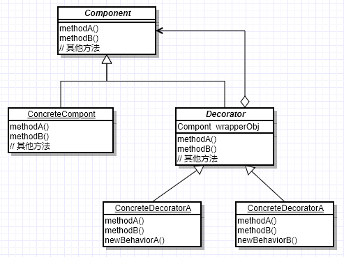

# 0、定义

~~~
这些组件可能只是完成了一些核心功能。但在不改变其结构的情况下，可以动态地扩展其功能。
~~~

## 装饰器模式

### 1、类图

~~~
抽象构件 Component是一个接口或者抽象类，是定义我们最核心的对象，也可以说是最原始的对象
具体构件 ConcreteComponent是最核心、最原始、最基本的接口或抽象类Component的实现，就是 被装饰对象
抽象装饰角色 Decorator，一般是一个抽象类，继承自或实现Component，在它的属性里面有一个变量指向Component抽象构件，完成装饰逻辑。
装饰角色 ConcreteDecoratorA和ConcreteDecoratorB是两个具体的装饰类，它们可以把基础构件装饰成新的东西，比如把一个普通肉夹馍装饰成鸡蛋里脊肉夹馍。
~~~

### 2、实现

~~~java
/**
 * 抽象构件
 */
public abstract class BatterCake {

    protected abstract String getMessage();

    protected abstract int getPrice();
}

/**
 * 具体构件
 */
public class BaseBatterCake extends BatterCake {

    @Override
    protected String getMessage() {
        return "煎饼果子";
    }

    @Override
    protected int getPrice() {
        return 5;
    }
}

/**
 * 抽象装饰角色
 */
@NoArgsConstructor
@AllArgsConstructor
public abstract class BatterCakeDecorator extends BatterCake {
    // 静态代理，委托
    private Battercake battercake;

    /**
     * this 指针 保证能够调回自己的方法
     * @return
     */
    @Override
    protected String getMessage() {
        addedBeforeFunction();
        String result = this.battercake.getMessage();
        addedAfterFunction();
        return result;
    }

    /**
     * this 指针
     * @return
     */
    @Override
    protected int getPrice() {
        addedBeforeFunction();
        String result = this.battercake.getPrice();
        addedAfterFunction();
        return result;
    }

    // 可以加额外功能方法
    protected abstract void addedBeforeFunction();

    // 可以加额外功能方法
    protected abstract void addedAfterFunction();
}

/**
 * 装饰角色
 */
public class EggDecorator extends BatterCakeDecorator {

    public EggDecorator(Battercake battercake) {
        super(battercake);
    }

    @Override
    protected String getMessage() {
        return super.getMessage();
    }

    @Override
    protected int getPrice() {
        return super.getPrice() + 2;
    }

    @Override
    protected void addedBeforeFunction() {
        System.out.println("egg before");
    }

    @Override
    protected void addedAfterFunction() {
        System.out.println("egg before");
    }
}

public class TestDeco {
    public static void main(String[] args) {
        BatterCake batterCake = new BaseBatterCake();

        EggDecorator eggDecorator = new EggDecorator(batterCake);

        System.out.println(eggDecorator.getMessage());
    }
}
~~~

### 3、优缺点

~~~
能够对被装饰对象进行增强，在被装饰对象 得 基本功能的基础上，扩展自定义的一些能力 （感觉与代理模式很类似）
~~~