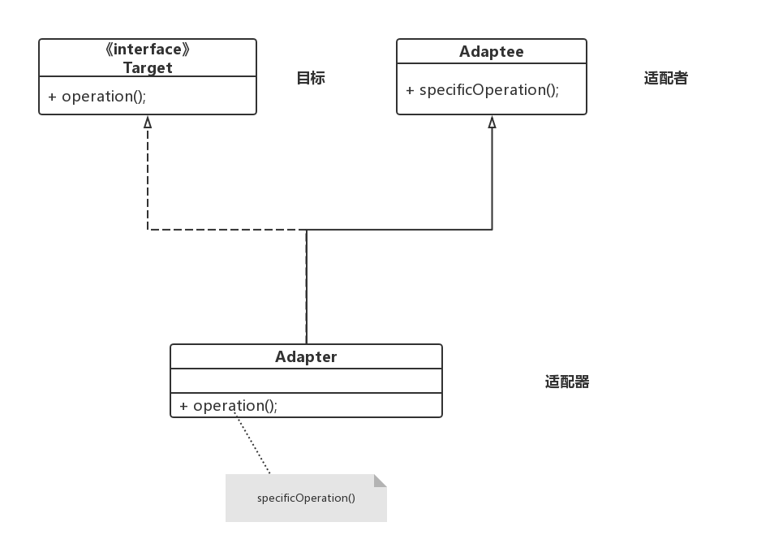

# 0、定义

~~~
将一个类的接口转换成客户希望的另外一个接口。
适配器模式使得原本由于接口不兼容而不能在一起工作的那些类可以一起工作。

~~~

## 适配器模式

~~~
目标角色（target）：这是客户锁期待的接口。目标可以是具体的或抽象的类，也可以是接口

适配者角色（adaptee）：已有接口，但是和客户器期待的接口不兼容。

适配器角色（adapter）：将已有接口转换成目标接口。
~~~

### 1、类图

### 2、实现

~~~java
/**
 * 适配者角色 -- 已有资源
 */
@Data
@AllArgsConstructor
@NoArgsConstructor
public class Origin {
    private int output;
}

/**
 * 适配器
 */
public interface Target {

    default Origin output220V(Origin origin) {
        System.out.println("电源输入电压 ：" + origin.getOutput());
        return new Origin(220);
    }

    default Origin output380V(Origin origin) {
        System.out.println("电源输入电压：  " + origin.getOutput());
        return new Origin(380);
    }
}

/**
 * help 适配器 能够 实列化
 */
public class Adapter implements Target {

}

/**
 * test
 */
public class Test {
    public static void main(String[] args) {
        Origin origin = new Origin(1000);

        Adapter adapter = new Adapter();

        System.out.println(adapter.output220V(origin).getOutput());
        System.out.println(adapter.output380V(origin).getOutput());
    }
}
~~~

### 3、优缺点

~~~
 由于适配器adapter类是适配者adaptee类的子类，因此可以在适配器类中置换一些适配者的方法，即Override（重写），使得适配器的灵活性更强。
~~~